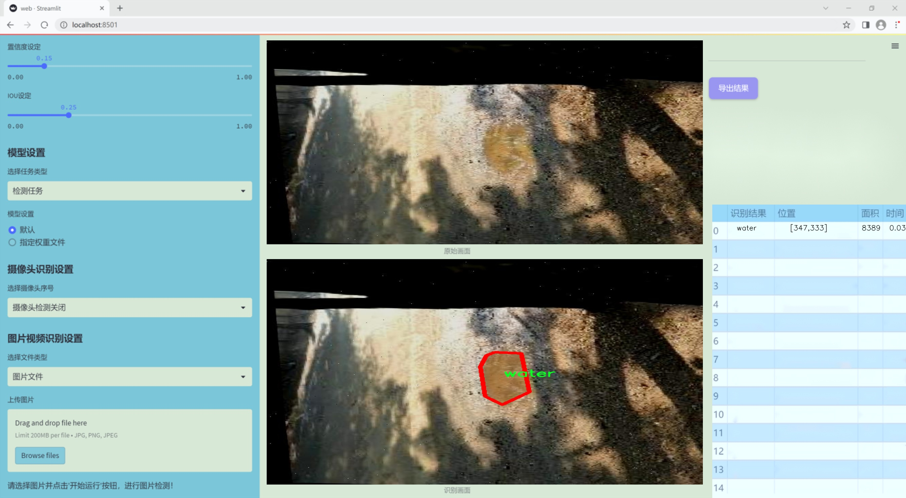
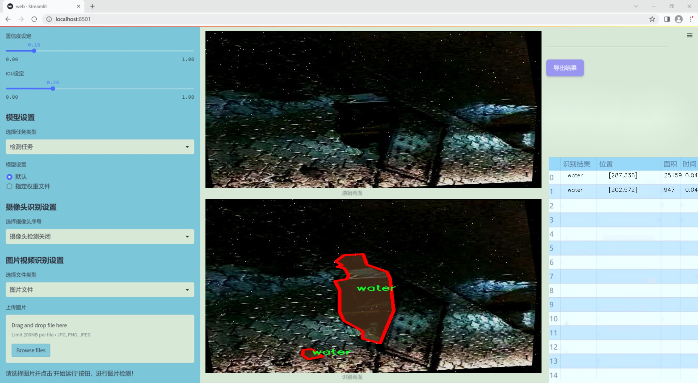
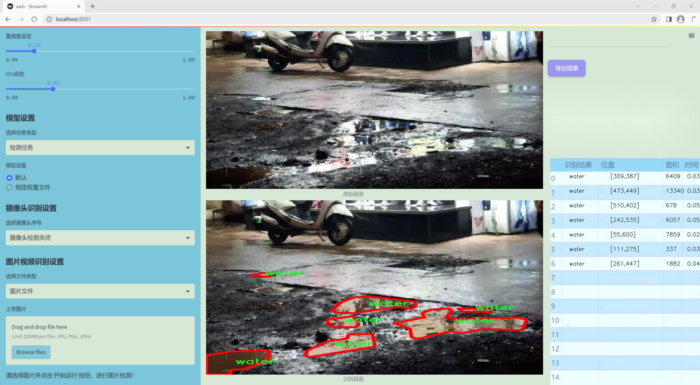
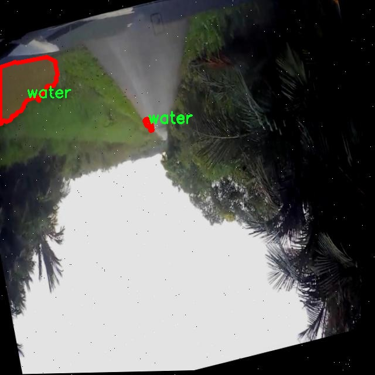
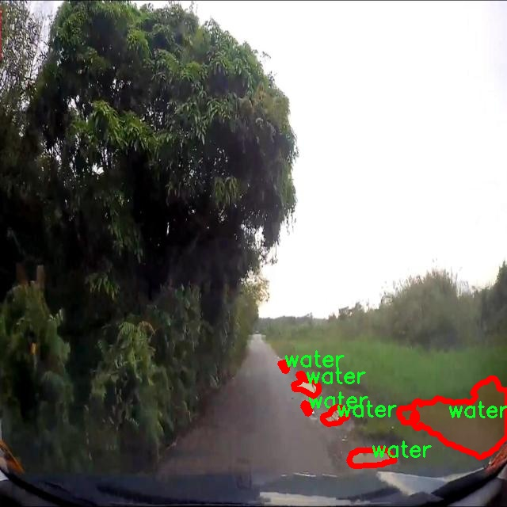
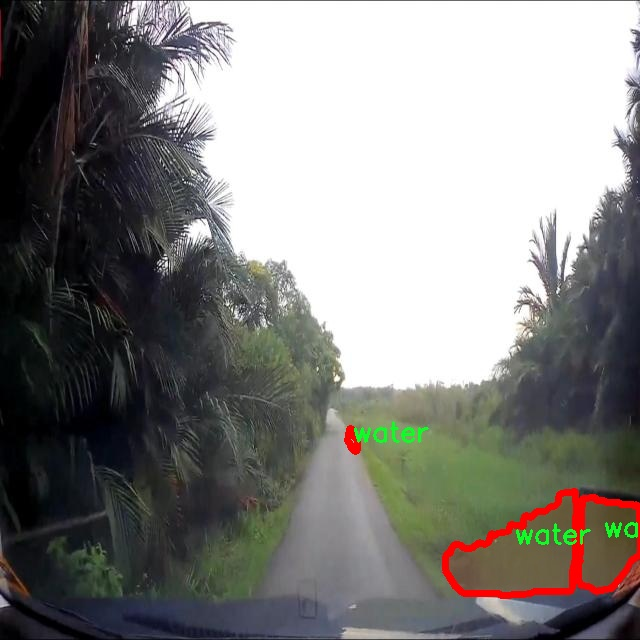
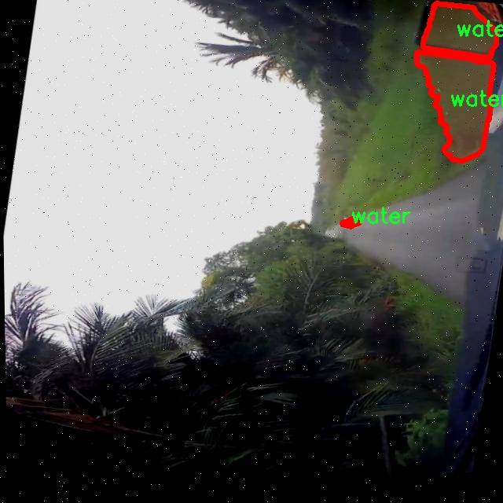
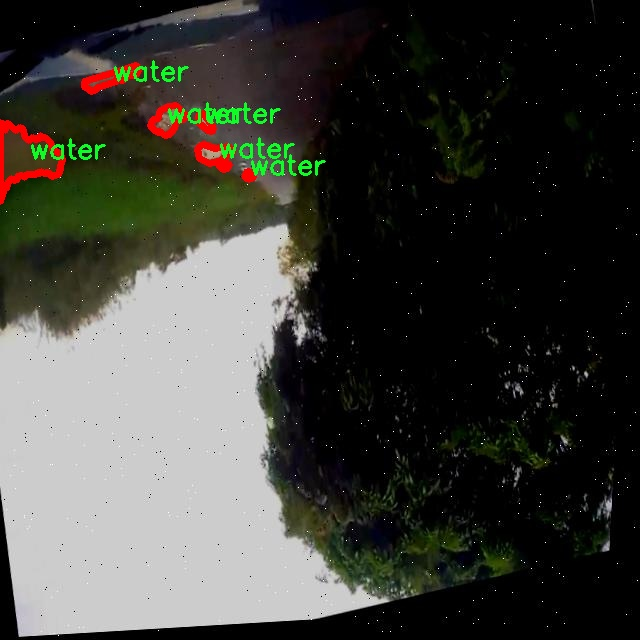

### 1.背景意义

研究背景与意义

水体的监测与管理在生态保护、城市规划和水资源管理等领域具有重要意义。随着全球气候变化和人类活动的加剧，水体污染和水资源短缺问题日益严重。因此，开发高效的水体分割检测系统，能够实时、准确地识别和监测水体的变化，对于制定科学的管理策略至关重要。传统的水体检测方法多依赖于人工观测和简单的图像处理技术，效率低下且易受人为因素影响。近年来，深度学习技术的迅猛发展为水体检测提供了新的解决方案，尤其是基于卷积神经网络（CNN）的目标检测算法，如YOLO（You Only Look Once）系列模型，因其高效性和准确性而受到广泛关注。

本研究旨在基于改进的YOLOv11模型，构建一个高效的水体分割检测系统。所使用的数据集“new-water-seg”包含2900幅经过精细标注的水体图像，涵盖了水体这一单一类别。通过对数据集的深入分析与处理，采用了多种数据增强技术，以提高模型的泛化能力和鲁棒性。这些技术包括随机翻转、旋转、亮度调整等，旨在模拟不同环境下的水体特征变化，从而增强模型对复杂场景的适应能力。

此外，随着计算机视觉技术的不断进步，基于深度学习的水体检测系统不仅能够提高检测精度，还能实现实时处理，为水资源的监测与管理提供有力支持。通过本研究的实施，期望能够为水体保护与管理提供一种新的技术手段，推动相关领域的研究与应用发展，为可持续发展目标的实现贡献力量。

### 2.视频效果

[2.1 视频效果](https://www.bilibili.com/video/BV1nnkFYmE1a/)

### 3.图片效果







##### [项目涉及的源码数据来源链接](https://kdocs.cn/l/cszuIiCKVNis)**

注意：本项目提供训练的数据集和训练教程,由于版本持续更新,暂不提供权重文件（best.pt）,请按照6.训练教程进行训练后实现上图演示的效果。

### 4.数据集信息

##### 4.1 本项目数据集类别数＆类别名

nc: 1
names: ['water']


该项目为【图像分割】数据集，请在【训练教程和Web端加载模型教程（第三步）】这一步的时候按照【图像分割】部分的教程来训练

##### 4.2 本项目数据集信息介绍

本项目数据集信息介绍

本项目所使用的数据集名为“new-water-seg”，旨在为改进YOLOv11的水体分割检测系统提供强有力的支持。该数据集专注于水体的精准识别与分割，特别适用于各种水体环境的分析与监测。数据集中包含了一个类别，即“water”，这使得模型在训练过程中能够专注于水体的特征提取与学习，从而提高检测的准确性和效率。

在数据集的构建过程中，我们收集了来自不同地理位置和环境条件下的水体图像，确保数据的多样性和代表性。这些图像涵盖了静态水体如湖泊、河流和水库，以及动态水体如海洋和潮汐区域，力求全面反映水体的不同形态和状态。每幅图像都经过精细标注，确保模型在训练时能够准确学习到水体的边界和特征。

为了提升模型的泛化能力，数据集中还包含了不同光照条件、天气状况以及季节变化下的水体图像。这种多样化的训练数据将有助于模型在实际应用中更好地适应各种环境，提高其在水体检测任务中的表现。此外，数据集还考虑到了不同分辨率和视角的图像，以增强模型对不同场景的适应性。

通过使用“new-water-seg”数据集，我们期望能够显著提升YOLOv11在水体分割检测方面的性能，使其在环境监测、资源管理和生态保护等领域发挥更大的作用。该数据集不仅为模型的训练提供了坚实的基础，也为后续的研究和应用提供了丰富的资源。











### 5.全套项目环境部署视频教程（零基础手把手教学）

[5.1 所需软件PyCharm和Anaconda安装教程（第一步）](https://www.bilibili.com/video/BV1BoC1YCEKi/?spm_id_from=333.999.0.0&vd_source=bc9aec86d164b67a7004b996143742dc)


[5.2 安装Python虚拟环境创建和依赖库安装视频教程（第二步）](https://www.bilibili.com/video/BV1ZoC1YCEBw?spm_id_from=333.788.videopod.sections&vd_source=bc9aec86d164b67a7004b996143742dc)

### 6.改进YOLOv11训练教程和Web_UI前端加载模型教程（零基础手把手教学）

[6.1 改进YOLOv11训练教程和Web_UI前端加载模型教程（第三步）](https://www.bilibili.com/video/BV1BoC1YCEhR?spm_id_from=333.788.videopod.sections&vd_source=bc9aec86d164b67a7004b996143742dc)


按照上面的训练视频教程链接加载项目提供的数据集，运行train.py即可开始训练



     Epoch   gpu_mem       box       obj       cls    labels  img_size
     1/200     20.8G   0.01576   0.01955  0.007536        22      1280: 100%|██████████| 849/849 [14:42<00:00,  1.04s/it]
               Class     Images     Labels          P          R     mAP@.5 mAP@.5:.95: 100%|██████████| 213/213 [01:14<00:00,  2.87it/s]
                 all       3395      17314      0.994      0.957      0.0957      0.0843

     Epoch   gpu_mem       box       obj       cls    labels  img_size
     2/200     20.8G   0.01578   0.01923  0.007006        22      1280: 100%|██████████| 849/849 [14:44<00:00,  1.04s/it]
               Class     Images     Labels          P          R     mAP@.5 mAP@.5:.95: 100%|██████████| 213/213 [01:12<00:00,  2.95it/s]
                 all       3395      17314      0.996      0.956      0.0957      0.0845

     Epoch   gpu_mem       box       obj       cls    labels  img_size
     3/200     20.8G   0.01561    0.0191  0.006895        27      1280: 100%|██████████| 849/849 [10:56<00:00,  1.29it/s]
               Class     Images     Labels          P          R     mAP@.5 mAP@.5:.95: 100%|███████   | 187/213 [00:52<00:00,  4.04it/s]
                 all       3395      17314      0.996      0.957      0.0957      0.0845


###### [项目数据集下载链接](https://kdocs.cn/l/cszuIiCKVNis)

### 7.原始YOLOv11算法讲解


##### YOLO11介绍

Ultralytics YOLO11是一款尖端的、最先进的模型，它在之前YOLO版本成功的基础上进行了构建，并引入了新功能和改进，以进一步提升性能和灵活性。
**YOLO11设计快速、准确且易于使用，使其成为各种物体检测和跟踪、实例分割、图像分类以及姿态估计任务的绝佳选择。**


**结构图如下：**


##### **C3k2**

**C3k2，结构图如下**


**C3k2，继承自类`C2f，其中通过c3k设置False或者Ture来决定选择使用C3k还是`**Bottleneck


**实现代码** **ultralytics/nn/modules/block.py**

##### C2PSA介绍

**借鉴V10 PSA结构，实现了C2PSA和C2fPSA，最终选择了基于C2的C2PSA（可能涨点更好？）**


**实现代码** **ultralytics/nn/modules/block.py**

##### Detect介绍

**分类检测头引入了DWConv（更加轻量级，为后续二次创新提供了改进点），结构图如下（和V8的区别）：**


### 8.200+种全套改进YOLOV11创新点原理讲解

#### 8.1 200+种全套改进YOLOV11创新点原理讲解大全

由于篇幅限制，每个创新点的具体原理讲解就不全部展开，具体见下列网址中的改进模块对应项目的技术原理博客网址【Blog】（创新点均为模块化搭建，原理适配YOLOv5~YOLOv11等各种版本）

[改进模块技术原理博客【Blog】网址链接](https://gitee.com/qunmasj/good)


#### 8.2 精选部分改进YOLOV11创新点原理讲解

###### 这里节选部分改进创新点展开原理讲解(完整的改进原理见上图和[改进模块技术原理博客链接](https://gitee.com/qunmasj/good)【如果此小节的图加载失败可以通过CSDN或者Github搜索该博客的标题访问原始博客，原始博客图片显示正常】


借鉴了其他算法的这些设计思想

借鉴了VGG的思想，使用了较多的3×3卷积，在每一次池化操作后，将通道数翻倍；

借鉴了network in network的思想，使用全局平均池化（global average pooling）做预测，并把1×1的卷积核置于3×3的卷积核之间，用来压缩特征；（我没找到这一步体现在哪里）

使用了批归一化层稳定模型训练，加速收敛，并且起到正则化作用。

    以上三点为Darknet19借鉴其他模型的点。Darknet53当然是在继承了Darknet19的这些优点的基础上再新增了下面这些优点的。因此列在了这里

借鉴了ResNet的思想，在网络中大量使用了残差连接，因此网络结构可以设计的很深，并且缓解了训练中梯度消失的问题，使得模型更容易收敛。

使用步长为2的卷积层代替池化层实现降采样。（这一点在经典的Darknet-53上是很明显的，output的长和宽从256降到128，再降低到64，一路降低到8，应该是通过步长为2的卷积层实现的；在YOLOv11的卷积层中也有体现，比如图中我标出的这些位置）

#### 特征融合

模型架构图如下

  Darknet-53的特点可以这样概括：（Conv卷积模块+Residual Block残差块）串行叠加4次

  Conv卷积层+Residual Block残差网络就被称为一个stage


上面红色指出的那个，原始的Darknet-53里面有一层 卷积，在YOLOv11里面，把一层卷积移除了

为什么移除呢？

        原始Darknet-53模型中间加的这个卷积层做了什么？滤波器（卷积核）的个数从 上一个卷积层的512个，先增加到1024个卷积核，然后下一层卷积的卷积核的个数又降低到512个

        移除掉这一层以后，少了1024个卷积核，就可以少做1024次卷积运算，同时也少了1024个3×3的卷积核的参数，也就是少了9×1024个参数需要拟合。这样可以大大减少了模型的参数，（相当于做了轻量化吧）

        移除掉这个卷积层，可能是因为作者发现移除掉这个卷积层以后，模型的score有所提升，所以才移除掉的。为什么移除掉以后，分数有所提高呢？可能是因为多了这些参数就容易，参数过多导致模型在训练集删过拟合，但是在测试集上表现很差，最终模型的分数比较低。你移除掉这个卷积层以后，参数减少了，过拟合现象不那么严重了，泛化能力增强了。当然这个是，拿着你做实验的结论，反过来再找补，再去强行解释这种现象的合理性。

过拟合


通过MMdetection官方绘制册这个图我们可以看到，进来的这张图片经过一个“Feature Pyramid Network(简称FPN)”，然后最后的P3、P4、P5传递给下一层的Neck和Head去做识别任务。 PAN（Path Aggregation Network）


“FPN是自顶向下，将高层的强语义特征传递下来。PAN就是在FPN的后面添加一个自底向上的金字塔，对FPN补充，将低层的强定位特征传递上去，

FPN是自顶（小尺寸，卷积次数多得到的结果，语义信息丰富）向下（大尺寸，卷积次数少得到的结果），将高层的强语义特征传递下来，对整个金字塔进行增强，不过只增强了语义信息，对定位信息没有传递。PAN就是针对这一点，在FPN的后面添加一个自底（卷积次数少，大尺寸）向上（卷积次数多，小尺寸，语义信息丰富）的金字塔，对FPN补充，将低层的强定位特征传递上去，又被称之为“双塔战术”。

FPN层自顶向下传达强语义特征，而特征金字塔则自底向上传达强定位特征，两两联手，从不同的主干层对不同的检测层进行参数聚合,这样的操作确实很皮。
#### 自底向上增强

而 PAN（Path Aggregation Network）是对 FPN 的一种改进，它的设计理念是在 FPN 后面添加一个自底向上的金字塔。PAN 引入了路径聚合的方式，通过将浅层特征图（低分辨率但语义信息较弱）和深层特征图（高分辨率但语义信息丰富）进行聚合，并沿着特定的路径传递特征信息，将低层的强定位特征传递上去。这样的操作能够进一步增强多尺度特征的表达能力，使得 PAN 在目标检测任务中表现更加优秀。


### 可重参化EfficientRepBiPAN优化Neck
#### Repvgg-style
Repvgg-style的卷积层包含
卷积+ReLU结构，该结构能够有效地利用硬件资源。

在训练时，Repvgg-style的卷积层包含
卷积、
卷积、identity。（下图左图）


在推理时，通过重参数化（re-parameterization），上述的多分支结构可以转换为单分支的
卷积。（下图右图）


基于上述思想，作者设计了对GPU硬件友好的EfficientRep Backbone和Rep-PAN Neck，将它们用于YOLOv6中。

EfficientRep Backbone的结构图：


Rep-PAN Neck结构图：


#### Multi-path
只使用repvgg-style不能达到很好的精度-速度平衡，对于大模型，作者探索了多路径的网络结构。

参考该博客提出了Bep unit，其结构如下图所示：


CSP（Cross Stage Partial）-style计算量小，且有丰富的梯度融合信息，广泛应用于YOLO系列中，比如YOLOv11、PPYOLOE。

作者将Bep unit与CSP-style结合，设计了一种新的网络结构BepC3，如下图所示：


基于BepC3模块，作者设计了新的CSPBep Backbone和CSPRepPAN Neck，以达到很好的精度-速度平衡。

其他YOLO系列在使用CSP-stype结构时，partial ratio设置为1/2。为了达到更好的性能，在YOLOv6m中partial ratio的值为2/3，在YOLOv6l中partial ratio的值为1/2。

对于YOLOv6m，单纯使用Rep-style结构和使用BepC3结构的对比如下图所示：

#### BIFPN
BiFPN 全称 Bidirectional Feature Pyramid Network 加权双向（自顶向下 + 自低向上）特征金字塔网络。

相比较于PANet，BiFPN在设计上的改变：

总结下图：
图d 蓝色部分为自顶向下的通路，传递的是高层特征的语义信息；红色部分是自底向上的通路，传递的是低层特征的位置信息；紫色部分是上述第二点提到的同一层在输入节点和输入节点间新加的一条边。


我们删除那些只有一条输入边的节点。这么做的思路很简单：如果一个节点只有一条输入边而没有特征融合，那么它对旨在融合不同特征的特征网络的贡献就会很小。删除它对我们的网络影响不大，同时简化了双向网络；如上图d 的 P7右边第一个节点

如果原始输入节点和输出节点处于同一层，我们会在原始输入节点和输出节点之间添加一条额外的边。思路：以在不增加太多成本的情况下融合更多的特性；

与只有一个自顶向下和一个自底向上路径的PANet不同，我们处理每个双向路径(自顶向下和自底而上)路径作为一个特征网络层，并重复同一层多次，以实现更高层次的特征融合。如下图EfficientNet 的网络结构所示，我们对BiFPN是重复使用多次的。而这个使用次数也不是我们认为设定的，而是作为参数一起加入网络的设计当中，使用NAS技术算出来的。


Weighted Feature Fusion 带权特征融合：学习不同输入特征的重要性，对不同输入特征有区分的融合。
设计思路：传统的特征融合往往只是简单的 feature map 叠加/相加 (sum them up)，比如使用concat或者shortcut连接，而不对同时加进来的 feature map 进行区分。然而，不同的输入 feature map 具有不同的分辨率，它们对融合输入 feature map 的贡献也是不同的，因此简单的对他们进行相加或叠加处理并不是最佳的操作。所以这里我们提出了一种简单而高效的加权特融合的机制。
常见的带权特征融合有三种方法，分别是：


​
  这种方法比较简单，直接加一个可学习的权重。但是由于这个权重不受限制，所有可能引起训练的不稳定，所有并不推荐。
Softmax-based fusion: O = ∑ i e w i ∗ I i ϵ + ∑ j e w j O = \sum_{i} \frac{e^{w_i} * I_i}{ \epsilon+\sum_{j}e^{w_j}}O=∑ 

 

​
  使用这种方法可以将范围放缩到 [ 0 , 1 ] [0, 1][0,1] 之间，训练稳定，但是训练很慢，所有也不推荐。
Fast normalized fusion: O = ∑ i w i ∗ I i ϵ + ∑ j w j O = \sum_{i} \frac{w_i * I_i}{ \epsilon+\sum_{j}w_j}O=∑ 


### 9.系统功能展示

图9.1.系统支持检测结果表格显示

  图9.2.系统支持置信度和IOU阈值手动调节

  图9.3.系统支持自定义加载权重文件best.pt(需要你通过步骤5中训练获得)

  图9.4.系统支持摄像头实时识别

  图9.5.系统支持图片识别

  图9.6.系统支持视频识别

  图9.7.系统支持识别结果文件自动保存

  图9.8.系统支持Excel导出检测结果数据


### 10. YOLOv11核心改进源码讲解

#### 10.1 revcol.py

下面是对您提供的代码的核心部分进行分析和注释的结果。代码的主要功能是实现一个基于反向传播的神经网络模块，使用了自定义的反向传播函数和多层结构。

```python
import torch
import torch.nn as nn

# 定义一个自定义的反向传播函数
class ReverseFunction(torch.autograd.Function):
    @staticmethod
    def forward(ctx, run_functions, alpha, *args):
        # 提取运行的函数和alpha参数
        l0, l1, l2, l3 = run_functions
        alpha0, alpha1, alpha2, alpha3 = alpha
        
        # 保存上下文信息
        ctx.run_functions = run_functions
        ctx.alpha = alpha
        
        # 记录输入张量
        x, c0, c1, c2, c3 = args
        
        # 使用torch.no_grad()来避免计算梯度
        with torch.no_grad():
            # 依次执行每一层的前向计算
            c0 = l0(x, c1) + c0 * alpha0
            c1 = l1(c0, c2) + c1 * alpha1
            c2 = l2(c1, c3) + c2 * alpha2
            c3 = l3(c2, None) + c3 * alpha3
        
        # 保存中间结果以便在反向传播时使用
        ctx.save_for_backward(x, c0, c1, c2, c3)
        return x, c0, c1, c2, c3

    @staticmethod
    def backward(ctx, *grad_outputs):
        # 从上下文中恢复保存的张量
        x, c0, c1, c2, c3 = ctx.saved_tensors
        l0, l1, l2, l3 = ctx.run_functions
        alpha0, alpha1, alpha2, alpha3 = ctx.alpha
        
        # 获取梯度
        gx_right, g0_right, g1_right, g2_right, g3_right = grad_outputs
        
        # 分别计算每一层的梯度
        # 这里省略了具体的计算细节
        # ...

        # 返回各层的梯度
        return None, None, gx_up, g0_left, g1_left, g2_left, g3_left

# 定义一个融合模块
class Fusion(nn.Module):
    def __init__(self, level, channels, first_col) -> None:
        super().__init__()
        self.level = level
        self.first_col = first_col
        # 定义下采样和上采样层
        self.down = Conv(channels[level-1], channels[level], k=2, s=2, p=0, act=False) if level in [1, 2, 3] else nn.Identity()
        if not first_col:
            self.up = nn.Sequential(Conv(channels[level+1], channels[level]), nn.Upsample(scale_factor=2, mode='nearest')) if level in [0, 1, 2] else nn.Identity()            

    def forward(self, *args):
        c_down, c_up = args
        # 根据层级和是否为第一列选择不同的前向计算方式
        if self.first_col:
            x = self.down(c_down)
            return x
        
        if self.level == 3:
            x = self.down(c_down)
        else:
            x = self.up(c_up) + self.down(c_down)
        return x

# 定义子网络
class SubNet(nn.Module):
    def __init__(self, channels, layers, kernel, first_col, save_memory) -> None:
        super().__init__()
        self.save_memory = save_memory
        # 初始化alpha参数
        self.alpha0 = nn.Parameter(torch.ones((1, channels[0], 1, 1)), requires_grad=True)
        self.alpha1 = nn.Parameter(torch.ones((1, channels[1], 1, 1)), requires_grad=True)
        self.alpha2 = nn.Parameter(torch.ones((1, channels[2], 1, 1)), requires_grad=True)
        self.alpha3 = nn.Parameter(torch.ones((1, channels[3], 1, 1)), requires_grad=True)

        # 定义每一层
        self.level0 = Level(0, channels, layers, kernel, first_col)
        self.level1 = Level(1, channels, layers, kernel, first_col)
        self.level2 = Level(2, channels, layers, kernel, first_col)
        self.level3 = Level(3, channels, layers, kernel, first_col)

    def forward(self, *args):
        # 根据是否保存内存选择不同的前向计算方式
        if self.save_memory:
            return self._forward_reverse(*args)
        else:
            return self._forward_nonreverse(*args)

# 定义主网络
class RevCol(nn.Module):
    def __init__(self, kernel='C2f', channels=[32, 64, 96, 128], layers=[2, 3, 6, 3], num_subnet=5, save_memory=True) -> None:
        super().__init__()
        self.num_subnet = num_subnet
        self.channels = channels
        self.layers = layers

        # 定义输入层
        self.stem = Conv(3, channels[0], k=4, s=4, p=0)

        # 添加多个子网络
        for i in range(num_subnet):
            first_col = True if i == 0 else False
            self.add_module(f'subnet{str(i)}', SubNet(channels, layers, kernel, first_col, save_memory=save_memory))

    def forward(self, x):
        c0, c1, c2, c3 = 0, 0, 0, 0
        x = self.stem(x)        
        for i in range(self.num_subnet):
            c0, c1, c2, c3 = getattr(self, f'subnet{str(i)}')(x, c0, c1, c2, c3)       
        return [c0, c1, c2, c3]
```

### 代码核心部分说明：
1. **ReverseFunction**: 自定义的反向传播函数，负责在前向传播时保存必要的状态，并在反向传播时计算梯度。
2. **Fusion**: 融合模块，用于处理不同层之间的特征融合，包括下采样和上采样。
3. **SubNet**: 子网络模块，包含多个层级的结构，使用不同的卷积层和融合层。
4. **RevCol**: 主网络结构，包含多个子网络，负责整体的前向传播和特征提取。

### 注释说明：
- 每个类和方法都附有详细的中文注释，解释其功能和工作原理。
- 省略了部分细节以简化代码，专注于核心逻辑和结构。

该文件 `revcol.py` 是一个基于 PyTorch 的深度学习模型实现，主要涉及反向传播和内存优化的技术。代码中定义了多个类和函数，构成了一个复杂的神经网络结构，特别适用于需要高效内存管理的场景。

首先，文件导入了必要的 PyTorch 模块，包括神经网络模块和分布式计算模块。同时，还引入了一些自定义的卷积和块模块。`__all__` 变量用于定义模块的公共接口。

接下来，定义了一些辅助函数。`get_gpu_states` 函数用于获取当前 GPU 的随机数生成状态，`get_gpu_device` 函数则用于从输入参数中提取出使用的 GPU 设备。`set_device_states` 函数用于设置 CPU 和 GPU 的随机数生成状态，确保在反向传播过程中状态的一致性。`detach_and_grad` 函数用于从输入中分离出张量并使其可求导，确保在计算图中正确处理梯度。`get_cpu_and_gpu_states` 函数则结合了 CPU 和 GPU 的状态获取。

`ReverseFunction` 类是一个自定义的 PyTorch 自动求导函数，包含 `forward` 和 `backward` 方法。在 `forward` 方法中，模型的前向传播通过多个函数和参数进行计算，并保存中间结果以便在反向传播时使用。`backward` 方法则实现了反向传播的逻辑，计算各层的梯度，并通过短路连接和特征反转技术来优化计算。

`Fusion` 类用于实现不同层之间的融合操作，根据层级和是否为第一列来决定如何处理输入。`Level` 类则定义了每一层的结构，包括融合和卷积操作。`SubNet` 类表示一个子网络，其中包含多个层，并实现了正向和反向传播的逻辑。

`RevCol` 类是整个模型的核心，负责构建网络结构。它初始化了多个子网络，并在前向传播中依次调用这些子网络进行计算。模型的设计考虑了内存的节省，允许在需要时选择是否使用反向传播的优化策略。

整体来看，该文件实现了一个高效的深度学习模型，利用了 PyTorch 的自动求导机制和内存管理技术，适合于需要大规模计算和高效内存使用的任务。

#### 10.2 attention.py

以下是经过简化和注释的核心代码部分，主要保留了 `EMA`、`SimAM`、`SpatialGroupEnhance`、`TopkRouting`、`KVGather`、`QKVLinear` 和 `BiLevelRoutingAttention` 类的实现。这些类在实现注意力机制时起着重要作用。

```python
import torch
from torch import nn
import torch.nn.functional as F

class EMA(nn.Module):
    def __init__(self, channels, factor=8):
        super(EMA, self).__init__()
        self.groups = factor  # 将通道分成多个组
        assert channels // self.groups > 0  # 确保每组至少有一个通道
        self.softmax = nn.Softmax(-1)  # 用于计算权重的softmax
        self.agp = nn.AdaptiveAvgPool2d((1, 1))  # 自适应平均池化
        self.pool_h = nn.AdaptiveAvgPool2d((None, 1))  # 对高度进行池化
        self.pool_w = nn.AdaptiveAvgPool2d((1, None))  # 对宽度进行池化
        self.gn = nn.GroupNorm(channels // self.groups, channels // self.groups)  # 组归一化
        self.conv1x1 = nn.Conv2d(channels // self.groups, channels // self.groups, kernel_size=1)  # 1x1卷积
        self.conv3x3 = nn.Conv2d(channels // self.groups, channels // self.groups, kernel_size=3, padding=1)  # 3x3卷积

    def forward(self, x):
        b, c, h, w = x.size()  # 获取输入的尺寸
        group_x = x.reshape(b * self.groups, -1, h, w)  # 将输入重塑为分组形式
        x_h = self.pool_h(group_x)  # 对高度进行池化
        x_w = self.pool_w(group_x).permute(0, 1, 3, 2)  # 对宽度进行池化并转置
        hw = self.conv1x1(torch.cat([x_h, x_w], dim=2))  # 1x1卷积
        x_h, x_w = torch.split(hw, [h, w], dim=2)  # 分割为高度和宽度
        x1 = self.gn(group_x * x_h.sigmoid() * x_w.permute(0, 1, 3, 2).sigmoid())  # 计算加权后的输出
        x2 = self.conv3x3(group_x)  # 3x3卷积
        # 计算权重
        x11 = self.softmax(self.agp(x1).reshape(b * self.groups, -1, 1).permute(0, 2, 1))
        x12 = x2.reshape(b * self.groups, c // self.groups, -1)  # 重塑为适合计算的形状
        x21 = self.softmax(self.agp(x2).reshape(b * self.groups, -1, 1).permute(0, 2, 1))
        x22 = x1.reshape(b * self.groups, c // self.groups, -1)  # 重塑为适合计算的形状
        weights = (torch.matmul(x11, x12) + torch.matmul(x21, x22)).reshape(b * self.groups, 1, h, w)  # 计算最终权重
        return (group_x * weights.sigmoid()).reshape(b, c, h, w)  # 返回加权后的输出

class SimAM(nn.Module):
    def __init__(self, e_lambda=1e-4):
        super(SimAM, self).__init__()
        self.activaton = nn.Sigmoid()  # 激活函数
        self.e_lambda = e_lambda  # 正则化参数

    def forward(self, x):
        b, c, h, w = x.size()  # 获取输入的尺寸
        n = w * h - 1  # 计算总的像素点数减去1
        x_minus_mu_square = (x - x.mean(dim=[2, 3], keepdim=True)).pow(2)  # 计算每个像素与均值的平方差
        y = x_minus_mu_square / (4 * (x_minus_mu_square.sum(dim=[2, 3], keepdim=True) / n + self.e_lambda)) + 0.5  # 计算y值
        return x * self.activaton(y)  # 返回加权后的输出

class SpatialGroupEnhance(nn.Module):
    def __init__(self, groups=8):
        super().__init__()
        self.groups = groups  # 组数
        self.avg_pool = nn.AdaptiveAvgPool2d(1)  # 自适应平均池化
        self.weight = nn.Parameter(torch.zeros(1, groups, 1, 1))  # 权重参数
        self.bias = nn.Parameter(torch.zeros(1, groups, 1, 1))  # 偏置参数
        self.sig = nn.Sigmoid()  # 激活函数
        self.init_weights()  # 初始化权重

    def init_weights(self):
        for m in self.modules():
            if isinstance(m, nn.Conv2d):
                nn.init.kaiming_normal_(m.weight, mode='fan_out')  # He初始化
                if m.bias is not None:
                    nn.init.constant_(m.bias, 0)  # 偏置初始化为0

    def forward(self, x):
        b, c, h, w = x.shape  # 获取输入的尺寸
        x = x.view(b * self.groups, -1, h, w)  # 重塑为分组形式
        xn = x * self.avg_pool(x)  # 计算加权
        xn = xn.sum(dim=1, keepdim=True)  # 按组求和
        t = xn.view(b * self.groups, -1)  # 重塑为适合计算的形状
        t = t - t.mean(dim=1, keepdim=True)  # 减去均值
        std = t.std(dim=1, keepdim=True) + 1e-5  # 计算标准差
        t = t / std  # 归一化
        t = t.view(b, self.groups, h, w)  # 重塑为适合计算的形状
        t = t * self.weight + self.bias  # 加权
        t = t.view(b * self.groups, 1, h, w)  # 重塑为适合计算的形状
        x = x * self.sig(t)  # 返回加权后的输出
        return x.view(b, c, h, w)  # 返回原始形状

class TopkRouting(nn.Module):
    def __init__(self, qk_dim, topk=4):
        super().__init__()
        self.topk = topk  # 选择的topk值
        self.qk_dim = qk_dim  # 查询和键的维度
        self.scale = qk_dim ** -0.5  # 缩放因子
        self.routing_act = nn.Softmax(dim=-1)  # softmax激活函数

    def forward(self, query: torch.Tensor, key: torch.Tensor):
        """
        Args:
            query, key: (n, p^2, c) tensor
        Return:
            r_weight, topk_index: (n, p^2, topk) tensor
        """
        query_hat, key_hat = query, key  # 获取查询和键
        attn_logit = (query_hat * self.scale) @ key_hat.transpose(-2, -1)  # 计算注意力logit
        topk_attn_logit, topk_index = torch.topk(attn_logit, k=self.topk, dim=-1)  # 获取topk
        r_weight = self.routing_act(topk_attn_logit)  # 计算权重
        return r_weight, topk_index  # 返回权重和索引

class KVGather(nn.Module):
    def __init__(self, mul_weight='none'):
        super().__init__()
        assert mul_weight in ['none', 'soft', 'hard']  # 确保加权方式有效
        self.mul_weight = mul_weight  # 存储加权方式

    def forward(self, r_idx: torch.Tensor, r_weight: torch.Tensor, kv: torch.Tensor):
        """
        r_idx: (n, p^2, topk) tensor
        r_weight: (n, p^2, topk) tensor
        kv: (n, p^2, w^2, c_kq+c_v)
        Return:
            (n, p^2, topk, w^2, c_kq+c_v) tensor
        """
        n, p2, w2, c_kv = kv.size()  # 获取kv的尺寸
        topk = r_idx.size(-1)  # 获取topk值
        topk_kv = torch.gather(kv.view(n, 1, p2, w2, c_kv).expand(-1, p2, -1, -1, -1),  # 根据索引选择kv
                                dim=2,
                                index=r_idx.view(n, p2, topk, 1, 1).expand(-1, -1, -1, w2, c_kv))  # 扩展索引
        if self.mul_weight == 'soft':
            topk_kv = r_weight.view(n, p2, topk, 1, 1) * topk_kv  # 进行加权
        return topk_kv  # 返回选择后的kv

class QKVLinear(nn.Module):
    def __init__(self, dim, qk_dim, bias=True):
        super().__init__()
        self.qkv = nn.Linear(dim, qk_dim + qk_dim + dim, bias=bias)  # 线性变换

    def forward(self, x):
        q, kv = self.qkv(x).split([self.qk_dim, self.qk_dim + x.size(1)], dim=-1)  # 分割为q和kv
        return q, kv  # 返回q和kv

class BiLevelRoutingAttention(nn.Module):
    def __init__(self, dim, num_heads=8, n_win=7, qk_dim=None, topk=4):
        super().__init__()
        self.dim = dim  # 输入维度
        self.n_win = n_win  # 窗口数量
        self.num_heads = num_heads  # 注意力头数量
        self.qk_dim = qk_dim or dim  # 查询和键的维度
        self.router = TopkRouting(qk_dim=self.qk_dim, topk=topk)  # 初始化路由器
        self.kv_gather = KVGather(mul_weight='soft')  # 初始化kv聚合器
        self.qkv = QKVLinear(self.dim, self.qk_dim)  # 初始化qkv线性变换

    def forward(self, x):
        """
        x: NHWC tensor
        Return:
            NHWC tensor
        """
        # 进行qkv映射
        q, kv = self.qkv(x)  # 获取q和kv
        # 进行注意力计算
        r_weight, r_idx = self.router(q, kv)  # 计算路由权重和索引
        kv_selected = self.kv_gather(r_idx, r_weight, kv)  # 选择kv
        # 返回经过注意力计算后的输出
        return kv_selected
```

### 代码注释说明：
1. **EMA**：实现了增强的多通道注意力机制，使用了自适应池化和卷积操作来计算通道之间的关系。
2. **SimAM**：实现了简单的自适应注意力机制，使用了均值和方差来计算加权。
3. **SpatialGroupEnhance**：通过自适应平均池化和卷积来增强空间特征。
4. **TopkRouting**：实现了基于查询和键的top-k路由机制。
5. **KVGather**：根据路由索引选择键值对。
6. **QKVLinear**：实现了查询、键和值的线性映射。
7. **BiLevelRoutingAttention**：结合了以上模块，实现了双层路由注意力机制。

这些模块在深度学习模型中用于实现复杂的注意力机制，能够有效地捕捉输入特征之间的关系。

这个程序文件 `attention.py` 实现了一系列用于深度学习中注意力机制的模块，主要用于图像处理和计算机视觉任务。以下是对代码的详细说明：

首先，文件导入了必要的库，包括 PyTorch 和一些其他的工具库，如 `torchvision` 和 `einops`。这些库提供了构建神经网络和处理张量的功能。

文件中定义了多个类，每个类实现了不同类型的注意力机制或相关模块。以下是一些主要类的介绍：

1. **EMA (Exponential Moving Average)**：这个类实现了一种基于通道的加权平均机制，通过对输入进行分组处理，计算每个组的加权平均，并使用 Sigmoid 函数生成权重。

2. **SimAM (Similarity Attention Module)**：这个模块使用了一种基于相似度的注意力机制，通过计算输入特征的均值和方差来生成注意力权重，并通过 Sigmoid 激活函数进行处理。

3. **SpatialGroupEnhance**：这个模块通过对输入特征进行空间增强，利用平均池化和 Sigmoid 激活函数来生成空间注意力权重。

4. **TopkRouting**：实现了一种可微分的 Top-k 路由机制，允许在注意力计算中选择最重要的特征。

5. **KVGather**：用于根据路由索引选择键值对（key-value pairs），并根据指定的权重进行加权。

6. **BiLevelRoutingAttention**：这个类实现了双层路由注意力机制，结合了全局和局部注意力的特性，允许在多个尺度上进行特征提取。

7. **CoordAtt**、**TripletAttention**、**BAMBlock** 等类实现了不同类型的注意力机制，分别关注不同的特征组合和通道关系。

8. **DeformConv** 和 **deformable_LKA**：实现了可变形卷积和相关的注意力机制，允许在卷积操作中引入形变，增强模型对输入特征的适应能力。

9. **EfficientAttention** 和 **LSKA**：这些类实现了高效的注意力机制，优化了计算效率，适用于大规模图像处理任务。

10. **SegNext_Attention** 和 **TransNeXt_AggregatedAttention**：这些模块结合了变换器（Transformer）架构和注意力机制，专门设计用于图像分割和其他视觉任务。

11. **LayerNorm** 和 **LayerNormProxy**：实现了层归一化功能，支持不同的数据格式。

12. **Conv2d_BN**：这个类将卷积层和批归一化层结合在一起，简化了模型的构建。

13. **CascadedGroupAttention** 和 **LocalWindowAttention**：实现了分组注意力和局部窗口注意力机制，适用于处理高维特征。

这些模块的组合使得该文件可以灵活地应用于各种计算机视觉任务，尤其是在需要处理复杂特征关系和上下文信息的场景中。每个模块都经过精心设计，以确保在计算效率和模型性能之间取得良好的平衡。

#### 10.3 predict.py

以下是代码中最核心的部分，并附上详细的中文注释：

```python
from ultralytics.engine.predictor import BasePredictor
from ultralytics.engine.results import Results
from ultralytics.utils import ops

class DetectionPredictor(BasePredictor):
    """
    DetectionPredictor类，继承自BasePredictor类，用于基于检测模型进行预测。
    """

    def postprocess(self, preds, img, orig_imgs):
        """
        对预测结果进行后处理，并返回Results对象的列表。

        参数:
        preds: 模型的预测结果
        img: 输入图像
        orig_imgs: 原始图像列表或张量

        返回:
        results: 包含后处理结果的Results对象列表
        """
        # 使用非极大值抑制（NMS）来过滤预测框
        preds = ops.non_max_suppression(
            preds,
            self.args.conf,  # 置信度阈值
            self.args.iou,    # IOU阈值
            agnostic=self.args.agnostic_nms,  # 是否使用类别无关的NMS
            max_det=self.args.max_det,  # 最大检测框数量
            classes=self.args.classes,   # 需要检测的类别
        )

        # 如果输入的原始图像不是列表，则将其转换为numpy数组
        if not isinstance(orig_imgs, list):  # 输入图像是torch.Tensor而不是列表
            orig_imgs = ops.convert_torch2numpy_batch(orig_imgs)

        results = []  # 存储后处理结果的列表
        for i, pred in enumerate(preds):
            orig_img = orig_imgs[i]  # 获取对应的原始图像
            # 将预测框的坐标缩放到原始图像的尺寸
            pred[:, :4] = ops.scale_boxes(img.shape[2:], pred[:, :4], orig_img.shape)
            img_path = self.batch[0][i]  # 获取图像路径
            # 创建Results对象并添加到结果列表中
            results.append(Results(orig_img, path=img_path, names=self.model.names, boxes=pred))
        
        return results  # 返回后处理结果
```

### 代码核心部分说明：
1. **类定义**：`DetectionPredictor`类继承自`BasePredictor`，用于实现基于检测模型的预测功能。
2. **后处理方法**：`postprocess`方法对模型的预测结果进行后处理，包括非极大值抑制和坐标缩放，最终返回一个包含预测结果的`Results`对象列表。
3. **非极大值抑制**：通过`ops.non_max_suppression`函数过滤掉重叠度高的预测框，以提高检测精度。
4. **坐标缩放**：将预测框的坐标从模型输入图像的尺寸缩放到原始图像的尺寸，以便于可视化和后续处理。
5. **结果存储**：将每个预测结果封装成`Results`对象，并存储在结果列表中，最终返回。

这个程序文件 `predict.py` 是一个用于目标检测的预测类，名为 `DetectionPredictor`，它继承自 `BasePredictor` 类。该类的主要功能是基于检测模型进行预测，并对预测结果进行后处理。

在文件的开头，导入了必要的模块，包括 `BasePredictor`、`Results` 和 `ops`。这些模块提供了基础的预测功能、结果处理和一些操作工具。

`DetectionPredictor` 类中包含一个方法 `postprocess`，该方法用于对模型的预测结果进行后处理。具体来说，它接收三个参数：`preds`（模型的预测结果）、`img`（输入图像）和 `orig_imgs`（原始图像）。在方法内部，首先调用 `ops.non_max_suppression` 函数对预测结果进行非极大值抑制，以减少冗余的检测框。这个过程涉及到一些参数，例如置信度阈值、IOU阈值、是否使用类别无关的NMS、最大检测框数量以及需要检测的类别。

接下来，方法检查 `orig_imgs` 是否为列表。如果不是，则将其转换为 NumPy 数组格式。然后，程序会遍历每个预测结果，调整检测框的坐标以适应原始图像的尺寸，并将每个结果封装成 `Results` 对象。每个 `Results` 对象包含了原始图像、图像路径、模型的类别名称以及检测框信息。最后，方法返回一个包含所有结果的列表。

该类的使用示例展示了如何创建一个 `DetectionPredictor` 实例，并通过调用 `predict_cli` 方法进行预测。这表明该类可以通过命令行接口进行使用，方便用户进行目标检测任务。整体而言，这个文件实现了一个目标检测模型的预测和结果处理的基本框架。

#### 10.4 lsknet.py

以下是经过简化和注释的核心代码部分：

```python
import torch
import torch.nn as nn
from functools import partial

class Mlp(nn.Module):
    """多层感知机模块，包含卷积层和激活函数"""
    def __init__(self, in_features, hidden_features=None, out_features=None, act_layer=nn.GELU, drop=0.):
        super().__init__()
        out_features = out_features or in_features  # 输出特征数
        hidden_features = hidden_features or in_features  # 隐藏层特征数
        self.fc1 = nn.Conv2d(in_features, hidden_features, 1)  # 第一层卷积
        self.dwconv = DWConv(hidden_features)  # 深度卷积
        self.act = act_layer()  # 激活函数
        self.fc2 = nn.Conv2d(hidden_features, out_features, 1)  # 第二层卷积
        self.drop = nn.Dropout(drop)  # Dropout层

    def forward(self, x):
        """前向传播"""
        x = self.fc1(x)
        x = self.dwconv(x)
        x = self.act(x)
        x = self.drop(x)
        x = self.fc2(x)
        x = self.drop(x)
        return x


class Attention(nn.Module):
    """注意力模块"""
    def __init__(self, d_model):
        super().__init__()
        self.proj_1 = nn.Conv2d(d_model, d_model, 1)  # 线性投影
        self.activation = nn.GELU()  # 激活函数
        self.spatial_gating_unit = LSKblock(d_model)  # 空间门控单元
        self.proj_2 = nn.Conv2d(d_model, d_model, 1)  # 线性投影

    def forward(self, x):
        """前向传播"""
        shortcut = x.clone()  # 残差连接
        x = self.proj_1(x)
        x = self.activation(x)
        x = self.spatial_gating_unit(x)
        x = self.proj_2(x)
        x = x + shortcut  # 加上残差
        return x


class Block(nn.Module):
    """基本块，包含注意力和多层感知机"""
    def __init__(self, dim, mlp_ratio=4., drop=0., drop_path=0., act_layer=nn.GELU):
        super().__init__()
        self.norm1 = nn.BatchNorm2d(dim)  # 归一化层
        self.norm2 = nn.BatchNorm2d(dim)  # 归一化层
        self.attn = Attention(dim)  # 注意力模块
        self.mlp = Mlp(in_features=dim, hidden_features=int(dim * mlp_ratio), act_layer=act_layer, drop=drop)  # MLP模块

    def forward(self, x):
        """前向传播"""
        x = x + self.attn(self.norm1(x))  # 注意力部分
        x = x + self.mlp(self.norm2(x))  # MLP部分
        return x


class OverlapPatchEmbed(nn.Module):
    """图像到补丁嵌入的转换"""
    def __init__(self, img_size=224, patch_size=7, stride=4, in_chans=3, embed_dim=768):
        super().__init__()
        self.proj = nn.Conv2d(in_chans, embed_dim, kernel_size=patch_size, stride=stride, padding=(patch_size // 2))  # 卷积层
        self.norm = nn.BatchNorm2d(embed_dim)  # 归一化层

    def forward(self, x):
        """前向传播"""
        x = self.proj(x)  # 图像转补丁
        x = self.norm(x)  # 归一化
        return x


class LSKNet(nn.Module):
    """LSKNet网络结构"""
    def __init__(self, img_size=224, in_chans=3, embed_dims=[64, 128, 256, 512], depths=[3, 4, 6, 3]):
        super().__init__()
        self.num_stages = len(depths)  # 网络阶段数

        for i in range(self.num_stages):
            patch_embed = OverlapPatchEmbed(img_size=img_size // (2 ** i), in_chans=in_chans if i == 0 else embed_dims[i - 1], embed_dim=embed_dims[i])
            block = nn.ModuleList([Block(dim=embed_dims[i]) for _ in range(depths[i])])  # 生成块
            norm = nn.LayerNorm(embed_dims[i])  # 归一化层
            setattr(self, f"patch_embed{i + 1}", patch_embed)
            setattr(self, f"block{i + 1}", block)
            setattr(self, f"norm{i + 1}", norm)

    def forward(self, x):
        """前向传播"""
        outs = []
        for i in range(self.num_stages):
            patch_embed = getattr(self, f"patch_embed{i + 1}")
            block = getattr(self, f"block{i + 1}")
            norm = getattr(self, f"norm{i + 1}")
            x = patch_embed(x)  # 嵌入补丁
            for blk in block:
                x = blk(x)  # 通过每个块
            x = norm(x)  # 归一化
            outs.append(x)  # 保存输出
        return outs


class DWConv(nn.Module):
    """深度卷积模块"""
    def __init__(self, dim=768):
        super(DWConv, self).__init__()
        self.dwconv = nn.Conv2d(dim, dim, 3, padding=1, groups=dim)  # 深度卷积

    def forward(self, x):
        """前向传播"""
        x = self.dwconv(x)
        return x


def lsknet_t(weights=''):
    """创建LSKNet_t模型"""
    model = LSKNet(embed_dims=[32, 64, 160, 256], depths=[3, 3, 5, 2])
    if weights:
        model.load_state_dict(torch.load(weights)['state_dict'])  # 加载权重
    return model

if __name__ == '__main__':
    model = lsknet_t('lsk_t_backbone-2ef8a593.pth')  # 实例化模型
    inputs = torch.randn((1, 3, 640, 640))  # 随机输入
    for i in model(inputs):
        print(i.size())  # 输出每个阶段的输出尺寸
```

### 代码说明：
1. **Mlp类**：实现了一个多层感知机，包含两个卷积层和一个深度卷积层，使用GELU激活函数。
2. **Attention类**：实现了一个注意力机制，包含两个线性投影和一个空间门控单元。
3. **Block类**：组合了注意力和多层感知机，形成一个基本的网络块。
4. **OverlapPatchEmbed类**：将输入图像转换为补丁并进行嵌入。
5. **LSKNet类**：构建整个网络结构，包含多个阶段，每个阶段由补丁嵌入、多个块和归一化层组成。
6. **DWConv类**：实现了深度卷积，用于特征提取。
7. **lsknet_t函数**：用于创建LSKNet_t模型并加载预训练权重。

这个程序文件 `lsknet.py` 实现了一个名为 LSKNet 的深度学习模型，主要用于图像处理任务。代码中使用了 PyTorch 框架，并定义了一系列的神经网络模块。以下是对代码的详细说明。

首先，导入了必要的库，包括 PyTorch 的核心库和一些辅助模块。`torch.nn` 提供了构建神经网络的基础组件，`timm.layers` 则引入了一些额外的层和工具函数。`numpy` 用于数值计算。

接下来，定义了几个类，每个类代表模型中的一个组件。

`Mlp` 类实现了一个多层感知机（MLP），包含两个卷积层和一个深度可分离卷积层。该类的构造函数允许用户指定输入特征、隐藏特征、输出特征、激活函数和 dropout 比例。在前向传播中，输入经过一系列的卷积、激活和 dropout 操作。

`LSKblock` 类是一个核心模块，使用了多个卷积层来提取特征并进行注意力机制的计算。它通过对输入进行卷积和空间卷积，生成两个注意力特征，然后将它们结合起来，最终通过一个卷积层输出加权后的特征。

`Attention` 类实现了一个注意力机制，包含两个卷积层和一个 `LSKblock`。在前向传播中，输入首先经过一个卷积和激活，然后通过 `LSKblock` 进行处理，最后再经过一个卷积层。

`Block` 类是模型的基本构建块，结合了注意力机制和 MLP。它使用批归一化层来规范化输入，并通过残差连接将输入与经过注意力和 MLP 处理后的输出相加。

`OverlapPatchEmbed` 类负责将输入图像转换为补丁嵌入。它使用卷积层将图像划分为多个补丁，并进行归一化处理。

`LSKNet` 类是整个模型的主类，负责将各个模块组合在一起。构造函数中定义了不同阶段的嵌入层、块和归一化层，并根据输入图像的大小和通道数初始化这些层。在前向传播中，输入依次经过每个阶段的嵌入、块和归一化，最终输出多个特征图。

`DWConv` 类实现了深度可分离卷积，主要用于在 `Mlp` 类中。

`update_weight` 函数用于更新模型的权重，将预训练模型的权重加载到当前模型中，确保权重的形状匹配。

`lsknet_t` 和 `lsknet_s` 函数分别定义了两种不同配置的 LSKNet 模型，允许用户加载预训练权重。

最后，在 `__main__` 块中，创建了一个 LSKNet 模型实例，并随机生成输入数据进行测试，打印输出特征图的尺寸。

整体来看，这个文件实现了一个灵活且强大的图像处理模型，适用于各种计算机视觉任务，具有良好的可扩展性和模块化设计。

### 11.完整训练+Web前端界面+200+种全套创新点源码、数据集获取


# [下载链接：https://mbd.pub/o/bread/Z5ybk55q](https://mbd.pub/o/bread/Z5ybk55q)